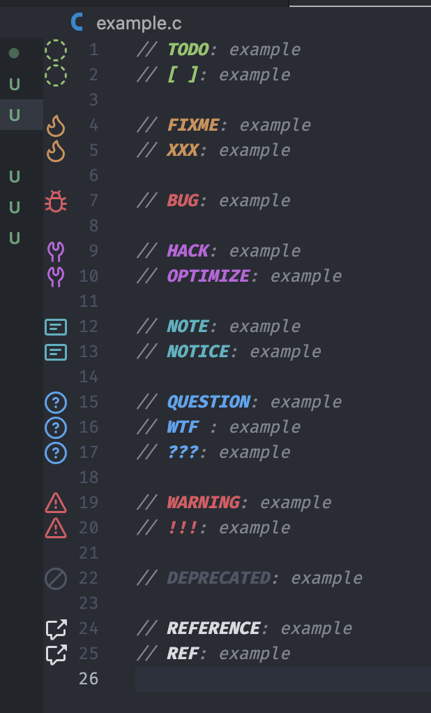

# TODO Tree Custom Highlight

> The English `README` was translated by ChatGPT from [`README_ZH`](./README_ZH.md).

- [1. Effect Display](#1-effect-display)
- [2. How to Use](#2-how-to-use)
- [3. Codetags Meaning](#3-codetags-meaning)

## 1. Effect Display

## 2. How to Use

Simply paste the configuration content of `./settings.json` into VSCode's `settings.json`.

Be sure to keep a backup of the original configuration and clean up any previous TODO Tree related configurations before use.

It is recommended to use the "Exclude `Markdown` files" configuration in `./settings.json`. TODO Tree matches comments using regular expressions, and if there are related keywords after the Markdown title #, they will also be highlighted as comments.

## 3. Codetags Meaning

- `TODO`: Indicates tasks or features that need to be completed. Usually used to remind developers of work to be done or enhancements to be implemented.
- `[ ]`: Symbolization of `TODO`.

- `FIXME`: Marks code that contains known issues or errors that need to be fixed. Indicates to developers that this part of the code has errors and needs correction.
- `XXX`: Similar to `FIXME`. Indicates that the code at this marker barely implements the functionality but needs improvement in the future.

- `BUG`: Points out specific errors in the code that need to be addressed. The comment describes the issue causing incorrect behavior or errors.

- `HACK`: Indicates a temporary or unconventional solution to a problem. Implies that the code may not be optimal and might need to be revisited or refactored in the future.
- `OPTIMIZE`: Points out code that can be improved for better performance or efficiency. Indicates opportunities for optimization to enhance speed, resource utilization, or scalability.

- `NOTE`: Provides additional information or important remarks about the code. Helps others understand the logic, special cases, or considerations that might not be immediately obvious.
- `NOTICE`: Similar to `NOTE`, emphasizes matters that need attention or awareness. Highlights noteworthy aspects or conditions in the code.

- `QUESTION`: Raises questions about the code, indicating uncertainty or areas that need clarification. May prompt further discussion or investigation among team members.
- `WTF`: Similar to `QUESTION`. Note: Contains informal or potentially offensive language, use with caution.
- `???`: Symbolization of `QUESTION`.

- `WARNING`: Alerts to potential issues or risks in the code. Suggests caution when dealing with this part, possibly pointing out dangerous operations or side effects.
- `!!!`: Symbolization of `WARNING`.

- `DEPRECATED`: Marks code that is outdated or no longer recommended for use. Implies that the code may be removed in the future and alternative solutions should be considered.

- `REFERENCE`: Provides references to related documentation, resources, or code. Helps developers find additional information or context related to this part.
- `REF`: Abbreviation of `REFERENCE`.
