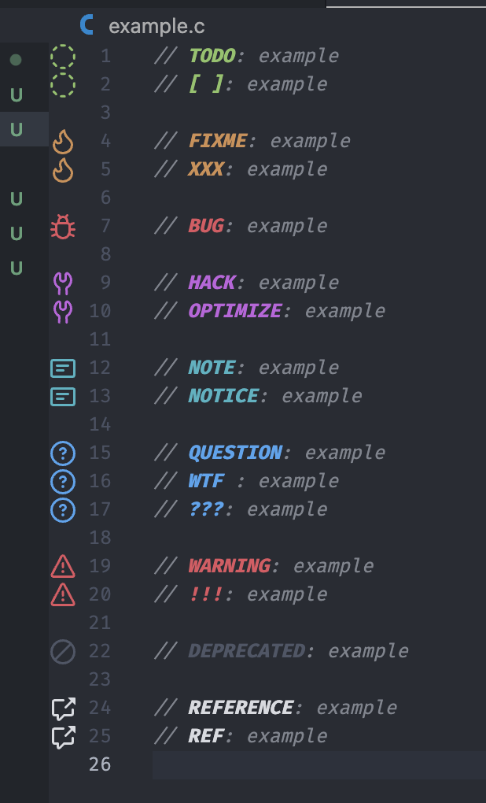

# TODO Tree Custom Highlight

- [1. 效果展示](#1-效果展示)
- [2. 如何使用](#2-如何使用)
- [3. Codetags 含义](#3-codetags-含义)

## 1. 效果展示

## 2. 如何使用

把 `./settings.json` 的配置内容直接粘贴到 VSCode 的 `settings.json` 即可。

注意保留原配置的备份，以及在使用前注意清理原先的 TODO Tree 相关配置。

建议使用 `./settings.json` 中的「排除 `Markdown` 文件」配置。TODO Tree 通过正则表达式匹配注释，如果在 Markdown 标题 # 后有相关关键字，也会被当作注释高亮。

## 3. Codetags 含义

- `TODO`: 表示需要完成的任务或功能。通常用于提醒开发者待完成的工作或需要实现的增强功能。
- `[ ]`: `TODO` 的符号化。

- `FIXME`: 标记包含已知问题或需要修复的错误的代码。提示开发者该部分代码有错误，需要修正。
- `XXX`: 类似于 `FIXME`。说明此标识处代码勉强实现了该功能，但是有待将来改进。

- `BUG`: 指出代码中需要处理的特定错误。注释描述了导致不正确行为或错误的问题。

- `HACK`: 表示对问题的临时或非常规解决方案。暗示代码可能不是最佳的，未来可能需要重新审视或重构。
- `OPTIMIZE`: 指出可以改进以获得更好性能或效率的代码。表示有机会进行优化，以提高速度、资源利用率或可扩展性。

- `NOTE`: 提供关于代码的额外信息或重要备注。帮助他人理解逻辑、特殊情况或可能不太明显的考虑因素。
- `NOTICE`: 类似于 `NOTE`，强调需要注意或意识到的事项。突出代码中值得注意的方面或条件。

- `QUESTION`: 提出关于代码的问题，表示不确定性或需要澄清的地方。可能促使团队成员之间进行进一步的讨论或调查。
- `WTF` : 类似于 `QUESTION`。注意：包含非正式或可能冒犯性的语言，使用时需谨慎。
- `???`: `QUESTION` 的符号化。

- `WARNING`: 警示代码中的潜在问题或风险。建议在处理此部分时要谨慎，可能会指出危险的操作或副作用。
- `!!!`: `WARNING` 的符号化。

- `DEPRECATED`: 标记已过时或不再推荐使用的代码。暗示该代码可能在未来被移除，应考虑替代方案。

- `REFERENCE`: 提供相关文档、资源或代码的参考。帮助开发者找到与此部分相关的附加信息或上下文。
- `REF`: `REFERENCE` 的缩写。
